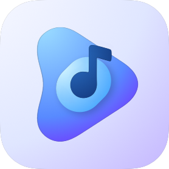
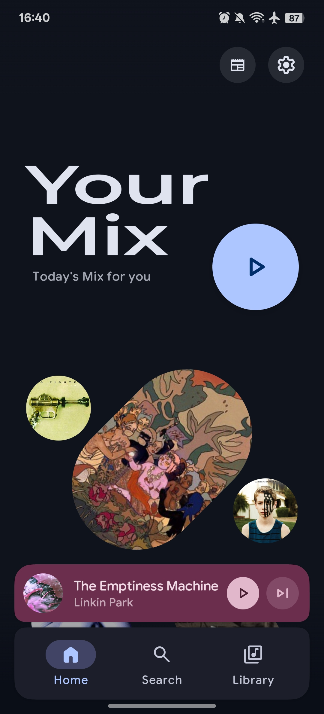
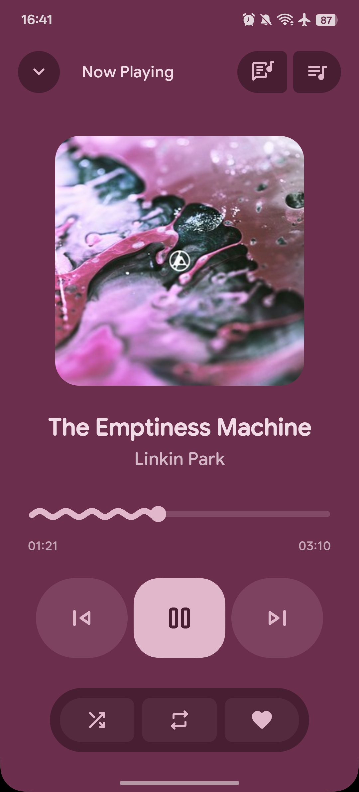
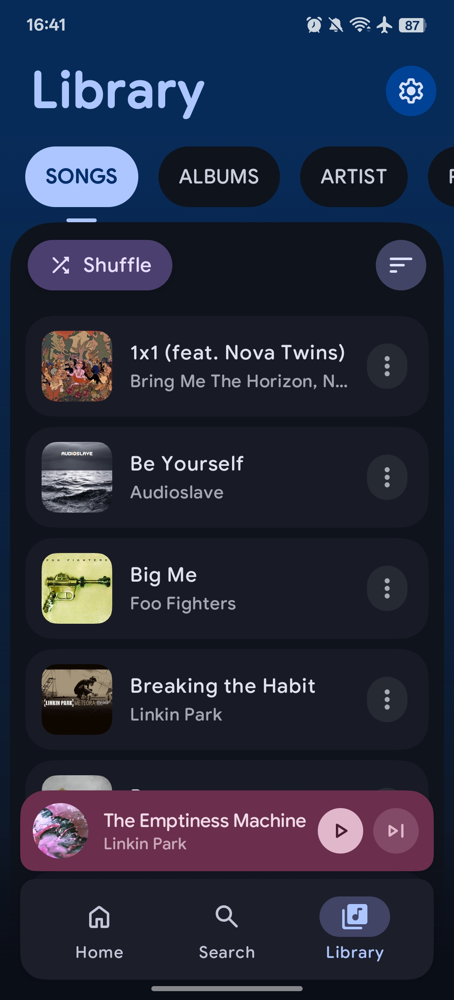
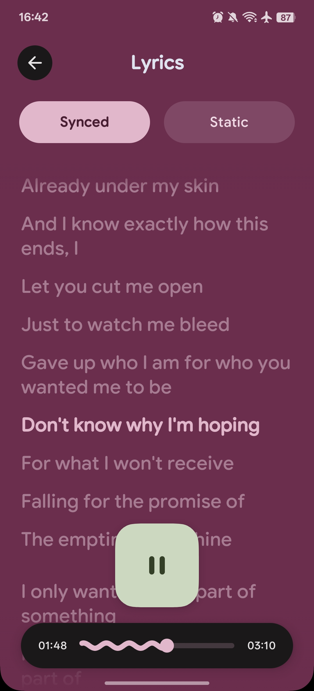

# PixelPlayerOSS

<p align="center">
  
</p>

<p align="center">
  <strong>A FOSS Android music player built with Kotlin, Jetpack Compose, and Material 3.</strong>
</p>

<p align="center">
  <a href="https://github.com/lostf1sh/PixelPlayerOSS/releases/latest">
    
  </a>
  <a href="https://github.com/lostf1sh/PixelPlayerOSS/releases">
    
  </a>
  
  
</p>

<p align="center">
  
  
  
  
</p>

## About

PixelPlayerOSS is a local-first Android music player maintained by [@lostf1sh](https://github.com/lostf1sh).

The project is intentionally kept FOSS-oriented. Removed integrations include Telegram, NetEase, QQ Music, Google Drive, Cast, Wear OS, Play Store billing, Firebase, Crashlytics, and Google Play Services runtime dependencies.

Package name: `com.lostf1sh.pixelplayeross`

## Features

### Playback

- Media3 playback engine with FFmpeg support.
- Gapless playback and configurable crossfade/custom transitions.
- Queue management, shuffle, repeat, sleep timer, and background playback.
- External file playback through Android intents.

### Library

- Local library scanning for common audio formats including MP3, FLAC, AAC, OGG, WAV, and M4A.
- Songs, albums, artists, genres, folders, favorites, playlists, and listening stats.
- Smart multi-artist parsing with configurable delimiters.
- Metadata editing through TagLib.

### Self-hosted Sources

- Navidrome/Subsonic login, sync, streaming, and artwork support.
- Jellyfin login, sync, streaming, and artwork support.
- Cloud playback is limited to self-hosted sources.

### UI

- Jetpack Compose and Material 3.
- Dynamic color, light/dark themes, and album-art color extraction.
- Glance home screen widgets.
- Smooth navigation transitions and expressive player surfaces.

### Lyrics And Artwork

- Synced lyrics through LRCLIB.
- Local lyrics import and editing.
- Artist artwork lookup through Deezer.
- Local cache for artwork and extracted color schemes.

### Backup

- App data backup and restore for preferences, playlists, favorites, lyrics, stats, and related app state.

## Requirements

- Android 11 or newer, API 30+.
- JDK 21 for local builds.
- Android SDK compile/target 37.

## Build

Clone the repository:

```sh
git clone https://github.com/lostf1sh/PixelPlayerOSS.git
cd PixelPlayerOSS
```

Build a debug APK:

```sh
JAVA_HOME=/usr/lib/jvm/java-21-openjdk ./gradlew :app:assembleDebug
```

Build one universal debug APK for local install:

```sh
JAVA_HOME=/usr/lib/jvm/java-21-openjdk ./gradlew :app:assembleDebug -Ppixelplay.enableAbiSplits=false
```

Run unit tests:

```sh
JAVA_HOME=/usr/lib/jvm/java-21-openjdk ./gradlew :app:testDebugUnitTest
```

Generate the baseline profile with a connected device or emulator:

```sh
JAVA_HOME=/usr/lib/jvm/java-21-openjdk ./gradlew :baselineprofile:generateBaselineProfile
```

## Download

GitHub releases will be published at:

```text
https://github.com/lostf1sh/PixelPlayerOSS/releases
```

Obtainium app id:

```text
com.lostf1sh.pixelplayeross
```

## Project Structure

```text
app/src/main/java/com/lostf1sh/pixelplayeross/
- data/             Room, repositories, preferences, services, workers
- di/               Hilt modules and qualifiers
- presentation/     Compose screens, components, navigation, ViewModels
- ui/               Theme and Glance widgets
- utils/            Shared utilities

baselineprofile/      Macrobenchmark and baseline profile generation
```

## Tech Stack

| Area | Technology |
| --- | --- |
| Language | Kotlin |
| UI | Jetpack Compose |
| Design | Material 3 |
| Playback | AndroidX Media3, ExoPlayer, FFmpeg |
| Database | Room |
| DI | Hilt |
| Preferences | DataStore |
| Background Work | WorkManager |
| Networking | Retrofit, OkHttp |
| Images | Coil |
| Metadata | TagLib |

## Contributing

Contributions are welcome. Open an issue or pull request with a focused change and include test/build results when possible.

Useful checks:

```sh
JAVA_HOME=/usr/lib/jvm/java-21-openjdk ./gradlew :app:compileDebugKotlin
JAVA_HOME=/usr/lib/jvm/java-21-openjdk ./gradlew :app:testDebugUnitTest
```

## License

PixelPlayerOSS is licensed under the [MIT License](LICENSE).

<p align="center">
  Maintained by <a href="https://github.com/lostf1sh">lostf1sh</a>
</p>
